## Introducción

Las **lenguas indoeuropeas** constituyen una de las familias lingüísticas más grandes y extendidas del mundo, abarcando la mayoría de los idiomas de Europa, la meseta iraní y el norte del subcontinente indio, además de regiones de América y Oceanía por la colonización.

Se cree que todas estas lenguas descienden de un ancestro común hipotético: el **protoindoeuropeo (PIE)**. Esta protolengua, que nunca fue escrita, habría sido hablada hace unos 6,000 años (c. 4000 a.C.) en las estepas pónticas, una vasta región al norte de los mares Negro y Caspio. Mediante el **método comparativo**, los lingüistas han reconstruido gran parte de su vocabulario y gramática analizando las similitudes sistemáticas entre sus lenguas descendientes.

Con el tiempo y las migraciones, el PIE se fragmentó en numerosas **ramas**, cada una evolucionando de forma independiente.

> **Diagrama del Árbol Genealógico**
> El siguiente diagrama representa las principales ramificaciones de la familia indoeuropea. Las lenguas marcadas en rojo están extintas, mientras que los nodos con fondo blanco representan protolenguas reconstruidas o agrupaciones. Una división fundamental es entre las ramas **Centum** (occidentales) y **Satem** (orientales), basada en la evolución de las consonantes velares del PIE.

-----

## Ramas Principales de la Familia Indoeuropea

### Rama Anatolia

  - **Primer testimonio:** c. 1800 a.C. (la más antigua de todas).
  - **Herederos modernos:** Ninguno.
  - **Dato clave:** Fue la primera rama en separarse del tronco común.

Las lenguas anatolias se hablaron en la antigua Anatolia (actual Turquía). Su miembro más conocido es el **hitita**, la lengua del poderoso Imperio Hitita, atestiguada en miles de tablillas de arcilla en escritura cuneiforme. Junto al hitita existieron otras como el **luvita** y el **licio**. Toda la rama se extinguió en la Antigüedad clásica sin dejar descendientes.

### Rama Tocaria

  - **Primer testimonio:** c. siglo VI d.C.
  - **Herederos modernos:** Ninguno.
  - **Dato clave:** Geográficamente, fue la rama más oriental.

Comprende dos lenguas extintas, **tocario A** y **tocario B**, habladas en la cuenca del Tarim (actual Xinjiang, China). A pesar de su ubicación oriental, son lenguas **Centum**, lo que sugiere una migración compleja. Los textos que se conservan son principalmente traducciones de escrituras budistas.

### Rama Itálica

  - **Primer testimonio:** c. siglo VII a.C.
  - **Herederos modernos:** Las lenguas romances (español, portugués, francés, italiano, rumano, catalán, etc.).
  - **Dato clave:** Su expansión global se debe al Imperio Romano.

Esta rama se desarrolló en la península itálica. Aunque en la antigüedad incluía idiomas como el **osco** y el **umbro**, todos fueron eclipsados por el **latín**, la lengua de Roma. Gracias a la expansión romana, el latín vulgar se convirtió en el ancestro de todas las **lenguas romances** actuales, las únicas supervivientes de esta rama.

### Rama Céltica

  - **Primer testimonio:** c. siglo VI a.C. (inscripciones leponticas).
  - **Herederos modernos:** Irlandés, galés, gaélico escocés, bretón, manés, córnico.
  - **Dato clave:** Antiguamente extendida por toda Europa, hoy sobrevive solo en la periferia atlántica.

Las lenguas celtas dominaron vastas regiones de Europa, desde la Galia (Francia) hasta Iberia y las Islas Británicas. Se dividen en:

  * **Celta continental:** Incluye el **galo** y el **celtíbero**. Todas estas lenguas se extinguieron, absorbidas por el latín.
  * **Celta insular:** Se desarrolló en Gran Bretaña e Irlanda, dando lugar a los idiomas celtas modernos. Se subdivide en el grupo **goidélico** (irlandés, gaélico escocés) y el **britónico** (galés, bretón).

### Rama Germánica

  - **Primer testimonio:** c. siglo II a.C. (inscripciones rúnicas).
  - **Herederos modernos:** Inglés, alemán, neerlandés, sueco, danés, noruego, islandés, yidis, etc.
  - **Dato clave:** Se caracteriza por cambios consonánticos sistemáticos conocidos como la **Ley de Grimm**.

Originada en el norte de Europa, esta rama se divide en tres subgrupos:

  * **Germánico oriental:** Completamente extinto. Su principal lengua fue el **gótico**, atestiguado en el siglo IV d.C. en la traducción de la Biblia de Ulfilas.
  * **Germánico septentrional (nórdico):** Desciende del **nórdico antiguo**, la lengua de los vikingos. De aquí provienen el **islandés**, **noruego**, **sueco** y **danés**.
  * **Germánico occidental:** La rama más grande. Incluye el **inglés antiguo** (anglosajón) y el **alto alemán antiguo**, ancestros del **inglés** y el **alemán** modernos, respectivamente, así como del **neerlandés** y el **frisón**.

### Rama Helénica (Griego)

  - **Primer testimonio:** c. 1450 a.C. (Lineal B).
  - **Herederos modernos:** Griego moderno.
  - **Dato clave:** Posee un registro escrito ininterrumpido de casi 3,500 años.

La historia de la lengua griega se extiende a través de varios períodos bien definidos. Comienza con la **época micénica** (aprox. 1500-1100 a.C.), cuyos textos datan del 1400 al 1200 a.C. Le sigue el período del **griego antiguo** (aprox. 800-600 a.C.), la lengua de Homero y Hesíodo. La **época clásica** abarca desde el 600 al 300 a.C., seguida por la **época helenística** (aprox. 300 a.C. - 300 d.C.), que incluye la koiné o griego del Nuevo Testamento. El **griego medio** se extiende desde el 300 hasta el 1600 d.C., subdividido en el período **bizantino** (hasta el 1100) y el **medieval** (hasta el 1600). Finalmente, el **griego moderno** surge alrededor del 1600 y continúa hasta hoy.

La lengua griega antigua no era uniforme; existían notables diferencias dialectales entre la Grecia continental, las islas del Egeo y Asia Menor. Estas variantes se clasifican en dos grandes grupos prehistóricos: el griego nordoriental/occidental y el griego meridional/oriental. Una distinción clave es que el primer grupo (que incluye los dialectos **dórico** y **eólico**) conservó el sonido indoeuropeo `*-ti`, mientras que el segundo grupo (que agrupa al **ático-jónico**, **arcado-chipriota** y **micénico**) lo transformó.

Los principales dialectos literarios fueron:

  * **Ático**: El dialecto de Atenas y la península del Ática. Gracias al prestigio cultural de Atenas, se convirtió en la lengua de una vasta literatura que incluye a los trágicos Esquilo, Sófocles y Eurípides; el filósofo Platón; y los historiadores Tucídides y Jenofonte.
  * **Jónico**: Originalmente una variante del ático-jónico, se habló en las islas Cícladas y Asia Menor. El dialecto épico de la *Ilíada* y la *Odisea* de Homero es una forma literaria tradicional basada principalmente en el jónico, pero mezclada con elementos eólicos y arcaísmos de la época micénica. El historiador Heródoto también escribió en prosa jónica.
  * **Eólico**: Hablado en Tesalia, Beocia y la isla de Lesbos. Sus testimonios literarios más importantes son los poemas de Safo y Alceo, ambos de Mitilene, en Lesbos.
  * **Dórico**: Una extensa subfamilia hablada en gran parte del Peloponeso y en colonias como las del sur de Italia. El poeta lírico espartano Alcmán escribió en un dórico literario con influencias eólicas. Este dialecto también aparece en fragmentos de comedias de Aristófanes y sobrevive en cierta medida en el tsakoniano moderno.

### Rama Indoirania

  - **Primer testimonio:** c. 1500 a.C.
  - **Herederos modernos:** Lenguas indoarias (hindi-urdú, bengalí, panyabí) y lenguas iranias (persa, pastún, kurdo).
  - **Dato clave:** Es la rama con el mayor número de hablantes nativos.

Esta super-rama se divide en dos grandes grupos:

  * **Sub-rama indoaria:** Se extendió por el norte de la India. Su lengua clásica es el **sánscrito**, en cuya forma más arcaica (védico) se compusieron los textos sagrados de los Vedas. De formas posteriores del sánscrito (los prácritos) descienden lenguas modernas como el **hindi-urdú**, el **bengalí** y el **panyabí**.
  * **Sub-rama irania:** Se desarrolló en la meseta iraní. Sus lenguas antiguas más importantes son el **avéstico** (lengua del zoroastrismo) y el **persa antiguo** (lengua del Imperio aqueménida). Sus descendientes modernos incluyen el **persa (farsi)**, el **pastún** y el **kurdo**.

### Super-rama Balto-Eslava

Este grupo une a las lenguas bálticas y eslavas, que comparten numerosas similitudes.

#### Rama Báltica

  - **Primer testimonio:** c. siglo XIV d.C.
  - **Herederos modernos:** Lituano, letón.
  - **Dato clave:** El lituano es considerado el idioma indoeuropeo vivo más conservador y arcaico.

Antiguamente habladas en un área más extensa junto al mar Báltico, hoy solo sobreviven dos lenguas de esta rama: el **lituano** y el **letón**. El **prusiano antiguo**, otro idioma báltico, se extinguió en el siglo XVIII.

#### Rama Eslava

  - **Primer testimonio:** siglo IX d.C.
  - **Herederos modernos:** Ruso, polaco, checo, búlgaro, serbo-croata, ucraniano, etc.
  - **Dato clave:** Se expandió rápidamente por Europa oriental durante la Alta Edad Media.

Todas las lenguas eslavas descienden del **protoeslavo**. Su primer testimonio escrito es el **antiguo eslavo eclesiástico**, estandarizado por los misioneros Cirilo y Metodio. Se dividen en:

  * **Eslavo oriental:** Ruso, ucraniano, bielorruso.
  * **Eslavo occidental:** Polaco, checo, eslovaco.
  * **Eslavo meridional:** Búlgaro, macedonio, esloveno, serbio, croata.

### Rama Armenia

  - **Primer testimonio:** siglo V d.C.
  - **Herederos modernos:** Armenio.
  - **Dato clave:** Constituye una rama independiente, aunque con fuerte influencia léxica del iranio.

El único miembro de esta rama es el **armenio**. Su forma clásica (el *grabar*) fue documentada por primera vez con la traducción de la Biblia tras la invención del alfabeto armenio. A pesar de su proximidad geográfica y contacto con la rama irania, su gramática y vocabulario básico confirman su estatus como una rama autónoma.

### Rama Albanesa

  - **Primer testimonio:** siglo XV d.C.
  - **Herederos modernos:** Albanés.
  - **Dato clave:** Es una de las ramas con la atestiguación escrita más tardía.

Representada únicamente por el idioma **albanés**, hablado en Albania, Kosovo y comunidades de los Balcanes. Su origen exacto es incierto, pero la hipótesis más aceptada lo considera el descendiente moderno de una de las lenguas paleobalcánicas, probablemente el **ilirio**.

### Ramas Fragmentarias y Lenguas Aisladas

Además de las ramas principales, existieron otras lenguas indoeuropeas de las que tenemos un conocimiento muy limitado, a menudo a través de breves inscripciones o nombres propios. Entre ellas se encuentran lenguas **paleobalcánicas** como el **frigio**, el **tracio** o el **ilirio**, así como otras lenguas de la Italia antigua como el **venético** o el **mesapio**. Estas lenguas se extinguieron sin dejar descendientes y su clasificación precisa dentro del árbol sigue siendo objeto de debate académico.

```mermaid
graph TD
    %% --- LEYENDA VISUAL ---
    %% Corregida para usar los estilos definidos, haciéndola funcional.
    subgraph Legend
        direction LR
        A[Rama Principal];
        B((LENGUA EXTINTA));
        C(Lengua Intermedia);
        D{Lengua Moderna};
    end

    %% --- DEFINICIÓN DE ESTILOS ---
    classDef branch fill:#e6e6fa,stroke:#333,stroke-width:2px;
    classDef extinct fill:#ffe6e6,stroke:#c00,stroke-width:2px,stroke-dasharray: 5 5;
    classDef intermediate fill:#f5f5dc,stroke:#333,stroke-width:1px;
    classDef modern fill:#e0f2f1,stroke:#00796b,stroke-width:2px;
    
    %% --- APLICACIÓN DE ESTILOS A LA LEYENDA ---
    class A branch;
    class B extinct;
    class C intermediate;
    class D modern;

    %% --- TRONCO PRINCIPAL ---
    PIE(Proto-Indo-Europeo);
    class PIE branch;

    %% --- RAMAS ---
    PIE --> Anatolia[Anatolia];
    PIE --> Tocharian[Tocaria];
    PIE --> Italic[Itálica];
    PIE --> Celtic[Céltica];
    PIE --> Germanic[Germánica];
    PIE --> Hellenic[Helénica];
    PIE --> IndoIranian[Indoirania];
    PIE --> BaltoSlavic[Balto-Esclava];
    PIE --> Armenian[Armenia];
    PIE --> Albanian[Albanés];
    class Anatolia,Tocharian,Italic,Celtic,Germanic,Hellenic,IndoIranian,BaltoSlavic,Armenian,Albanian branch;

    %% Anatolia
    Anatolia --> Hittite((Hitita));
    Anatolia --> Luwian((Luvita));
    class Hittite,Luwian extinct;

    %% Toquaria
    Tocharian --> TocA((Tocario A));
    Tocharian --> TocB((Tocario B));
    class TocA,TocB extinct;

    %% Itálica
    %% Corregido: La línea del Osco ha sido movida a su sección lógica.
    Italic --> Oscan((Osco));
    Italic --> Latin(Latín);
    Latin --> Romance(Lenguas Romances);
    Romance --> Spanish{Español};
    Romance --> French{Francés};
    Romance --> Italian{Italiano};
    class Oscan extinct;
    class Latin,Romance intermediate;
    class Spanish,French,Italian modern;

    %% Céltica
    Celtic --> Gallo((Galo));
    Celtic --> Insular(Celta Insular);
    Insular --> Goidelic(Goidélico);
    Insular --> Brittonic(Britónico);
    Goidelic --> Irish{Irlandés};
    Goidelic --> ScottishGael{Gaélico Escocés};
    Brittonic --> Welsh{Galés};
    Brittonic --> Breton{Bretón};
    class Gallo extinct;
    class Insular,Goidelic,Brittonic intermediate;
    class Irish,ScottishGael,Welsh,Breton modern;

    %% Germánica
    Germanic --> EastGermanic(Germ. Oriental);
    EastGermanic --> Gothic((Gótico));
    Germanic --> NorthGermanic(Germ. Septentrional);
    NorthGermanic --> OldNorse(Nórdico Antiguo);
    OldNorse --> Icelandic{Islandés};
    OldNorse --> Norwegian{Noruego};
    Germanic --> WestGermanic(Germ. Occidental);
    WestGermanic --> OldEnglish(Inglés Antiguo);
    OldEnglish --> English{Inglés};
    WestGermanic --> OldHighGerman(Alto Alemán Ant.);
    OldHighGerman --> German{Alemán};
    class EastGermanic,NorthGermanic,WestGermanic,OldNorse,OldEnglish,OldHighGerman intermediate;
    class Gothic extinct;
    class Icelandic,Norwegian,English,German modern;

    %% Helénica
    Hellenic --> Mycenaean(Griego Micénico);
    Mycenaean --> AncientGreek(Griego Clásico);
    AncientGreek --> ModernGreek{Griego Moderno};
    class Mycenaean,AncientGreek intermediate;
    class ModernGreek modern;

    %% Indoirania
    IndoIranian --> IndoAryan(Indoario);
    IndoAryan --> Sanskrit(Sánscrito);
    Sanskrit --> Hindi{Hindi/Urdu};
    Sanskrit --> Bengali{Bengalí};
    IndoIranian --> Iranian(Iranio);
    Iranian --> Avestan((Avéstico));
    Iranian --> OldPersian(Persa Antiguo);
    OldPersian --> Persian{Persa Moderno};
    class IndoAryan,Iranian,Sanskrit,OldPersian intermediate;
    class Avestan extinct;
    class Hindi,Bengali,Persian modern;

    %% Balto-Esclava
    BaltoSlavic --> Baltic(Báltico);
    Baltic --> OldPrussian((Prusiano Antiguo));
    Baltic --> Lithuanian{Lituano};
    Baltic --> Latvian{Letón};
    BaltoSlavic --> Slavic(Eslavo);
    Slavic --> OCS(Ant. Eslavo Eclesiástico);
    OCS --> EastSlavic(Eslavo Oriental);
    EastSlavic --> Russian{Ruso};
    OCS --> WestSlavic(Eslavo Occidental);
    WestSlavic --> Polish{Polaco};
    OCS --> SouthSlavic(Eslavo Meridional);
    SouthSlavic --> Bulgarian{Búlgaro};
    class Baltic,Slavic,OCS,EastSlavic,WestSlavic,SouthSlavic intermediate;
    class OldPrussian extinct;
    class Lithuanian,Latvian,Russian,Polish,Bulgarian modern;

    %% Armenia & Albanés
    Armenian --> ClassicalArmenian(Armenio Clásico);
    ClassicalArmenian --> ModernArmenian{Armenio Moderno};
    Albanian --> ModernAlbanian{Albanés};
    class ClassicalArmenian intermediate;
    class ModernArmenian,ModernAlbanian modern;
```

